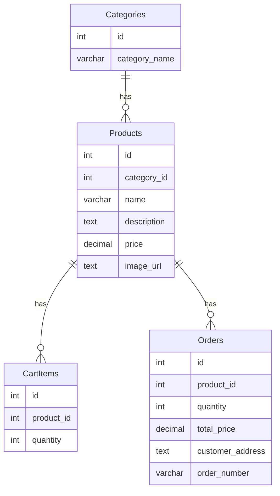

### 요구사항

#### 1. 기능

```
1. 상품 리스트 
- 상품 리스트 (상품 이미지, 이름, 가격)
- 상품 분류 기능
- 페이지네이션 기능

2. 상품 상세
- 상품 이미지, 이름, 설명, 가격 체크
- 수량 옵션, 장바구니 버튼, 바로 구매하기 

3. 장바구니
- 장바구니로 들어온 상품 이미지, 이름, 가격, 수량
- 추가, 삭제 기능
- 한꺼번에 구매 기능

4. 구매하기
- 상품 이미지, 이름, 설명, 가격, 수량에 따른 전체 금액 계산
- 주소 입력
- 주문 번호 생성하여 알려주기
```

#### 2. 테이블 DDL

```
-- 상품 분류 테이블
CREATE TABLE Categories (
    id SERIAL PRIMARY KEY,
    category_name VARCHAR(100) NOT NULL
);

-- 상품 리스트 테이블
CREATE TABLE Products (
    id SERIAL PRIMARY KEY,
    category_id INT NOT NULL,
    name VARCHAR(100) NOT NULL,
    description TEXT,
    price DECIMAL(10, 2) NOT NULL,
    image_url TEXT,
    FOREIGN KEY (category_id) REFERENCES Categories(id) ON DELETE CASCADE
);

-- 장바구니 아이템 테이블
CREATE TABLE CartItems (
    id SERIAL PRIMARY KEY,
    product_id INT NOT NULL,
    quantity INT NOT NULL CHECK (quantity > 0),
    FOREIGN KEY (product_id) REFERENCES Products(id) ON DELETE CASCADE
);

-- 주문정보 테이블
CREATE TABLE Orders (
    id SERIAL PRIMARY KEY,
    product_id INT NOT NULL,
    quantity INT NOT NULL CHECK (quantity > 0),
    total_price DECIMAL(10, 2) NOT NULL,
    customer_address TEXT NOT NULL,
    order_number VARCHAR(255) NOT NULL UNIQUE,
    FOREIGN KEY (product_id) REFERENCES Products(id) ON DELETE CASCADE
);
```

#### 3. ERD



#### 4. sequenceDiagram

```
sequenceDiagram
    User->>Products: 상품 선택
    Products-->>User: 선택한 상품의 정보(이름, 가격, 이미지 등) 전달
    User->>CartItems: 선택한 상품을 장바구니에 추가 요청
    CartItems->>Products: 상품 정보 확인 요청
    Products-->>CartItems: 상품 정보 확인 결과 전달
    CartItems-->>User: 장바구니에 상품 추가 완료 및 현재 장바구니 상태 전달
    User->>Orders: 장바구니의 상품들을 구매 요청
    Orders->>CartItems: 장바구니 상품 정보 확인 요청
    CartItems-->>Orders: 장바구니 상품 정보 확인 결과 전달
    Orders-->>User: 주문 완료 및 주문 번호, 상세 정보 전달
```